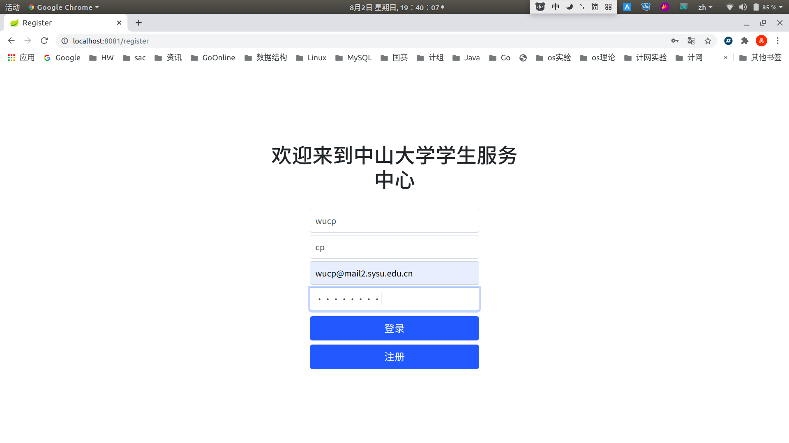
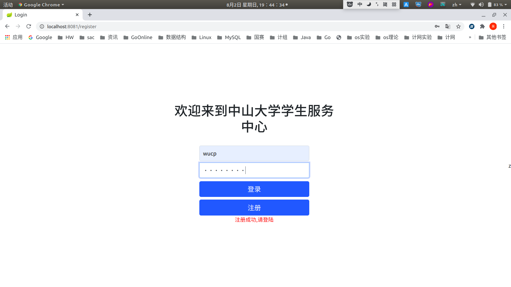

README
======

#### 1 开发环境

IDEA 2020

Ubuntu 18.04

Java SDK 1.8

#### 2 技术栈

模板引擎 ：Thymeleaf

前端框架 ：Bootstrap

后端：Spring Boot+Gradle

数据库：Mysql

#### 2 实现功能

- 注册
- 登录：登陆后通过session的方式让后端识别操作者身份
- 学生管理台
	- 此页仅示意17个功能。
- 登录拦截器：以防用户即使不登录也能通过url的方式访问到管理台界面
- 解决了刷新时表单重复提交的问题
- 退出登录

#### 3 具体页面

注册：

登录：

当用户没有登录却试图通过输入url直接进入管理台时，进行拦截：

进行各种交互的主页面，左侧选择各项服务，右上角退出登录，余下整体页面进行各种UI交互：

#### 4 如果您要运行这个项目

- 下载源码，导入idea或其他软件
- 启动项目，进入localhost:8081/register