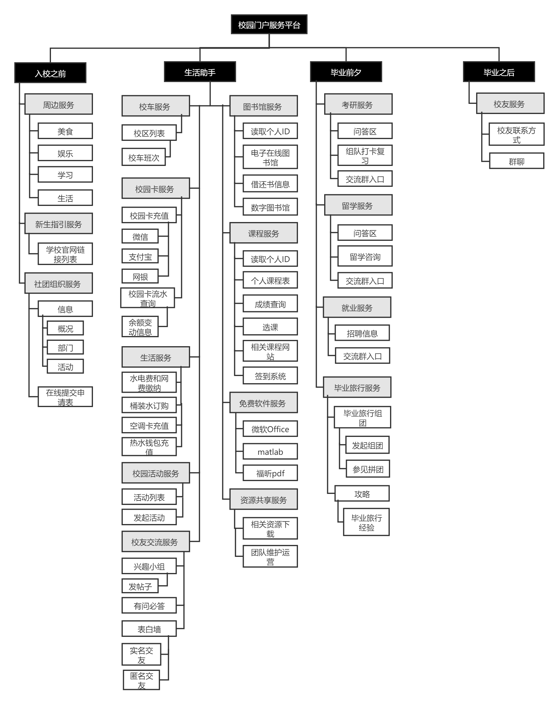
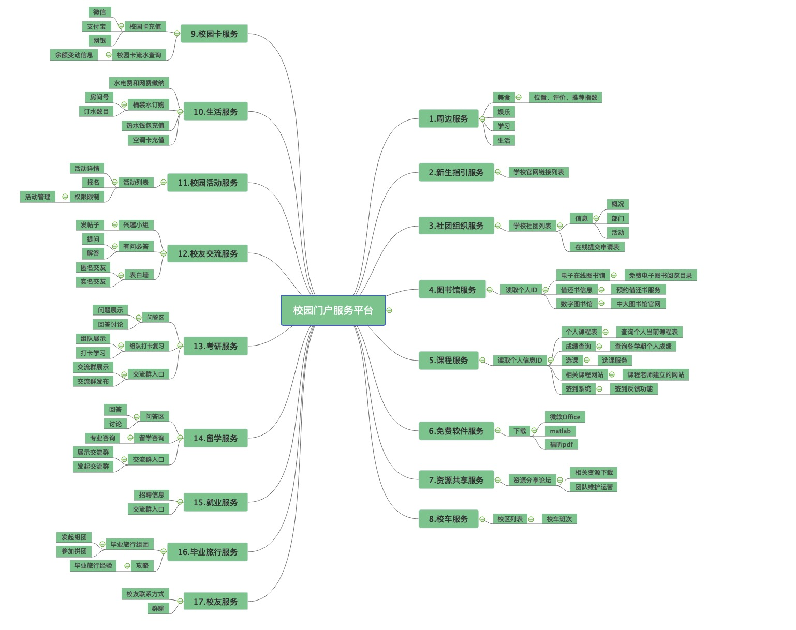

# 项目管理文档

## 一、WBS与思维导图

- WBS

  

- 思维导图

  

## 二、甘特图和网络图

- 项目进度表

  

- 甘特图

  

- 网络图

  

## 三、项目模型与成本基线图

### 1. 项目管理

#### 	1.1 项目经理

#### 	1.2 项目其他成员

- 项目经理（组长）工资 10元/小时

- 项目其他成员（组员）工资 5元/小时

- 无外包，无额外硬件成本。

- 项目预算10000

### 2. 需求定义

### 3. 网站设计

#### 	3.1 登录与注册

#### 	3.2 学生管理台

#### 	3.3 登录拦截系统

### 4. 网站开发

#### 	4.1 登录与注册

#### 	4.2 学生管理台

#### 	4.3 登录拦截系统

### 5. 测试

### 6. 测试、运行和支持

### 成本模型

| WBS条目            | 小时数 | 单位小时成本（元） | 子层总和（元） | WBS2级总和（元） | 占总和的百分比 |
| ------------------ | ------ | ------------------ | -------------- | ---------------- | -------------- |
| 1.项目管理         |        |                    |                | 1500             | 15%            |
| 1.1项目经理        | 50     | 10                 | 500            |                  |                |
| 1.2项目其他成员    | 200    | 5                  | 1000           |                  |                |
| 2.需求定义         | 50     | 20                 |                | 1000             | 10%            |
| 3.网站设计         |        |                    |                | 3000             | 30%            |
| 3.1入校之前模块    | 25     | 10                 | 250            |                  |                |
| 3.2生活助手模块    | 50     | 40                 | 2000           |                  |                |
| 3.3 毕业前夕模块   | 25     | 20                 | 500            |                  |                |
| 3.4 毕业之后模块   | 25     | 10                 | 250            |                  |                |
| 4.网站开发         |        |                    |                | 3000             | 30%            |
| 4.1入校之前模块    | 25     | 10                 | 250            |                  |                |
| 4.2生活助手模块    | 50     | 40                 | 2000           |                  |                |
| 4.3毕业之前模块    | 25     | 20                 | 500            |                  |                |
| 4.4 毕业之后模块   | 25     | 10                 | 250            |                  |                |
| 5.测试             | 25     | 20                 |                | 500              | 5%             |
| 6.测试、运行和支持 | 50     | 20                 |                | 1000             | 10%            |
| 总项目成本估计     |        |                    |                | 10000            |                |

 

### 每三天（一周期）成本基线

| WBS条目            | 1     | 2     | 3     | 4     | 5     | 6     | 7     | 总和  |
| ------------------ | ----- | ----- | ----- | ----- | ----- | ----- | ----- | ----- |
| 1.项目管理         |       |       |       |       |       |       |       | 1500  |
| 1.1项目经理        | 71.4  | 71.4  | 71.4  | 71.4  | 71.4  | 71.4  | 71.4  | 500   |
| 1.2项目其他成员    | 142.8 | 142.8 | 142.8 | 142.8 | 142.8 | 142.8 | 142.8 | 1000  |
| 2.需求定义         | 500   | 500   |       |       |       |       |       | 1000  |
| 3.网站设计         |       |       |       |       |       |       |       | 3000  |
| 3.1入校之前模块    |       |       |       |       |       |       |       |       |
| 3.2生活服务模块    |       |       |       |       |       |       |       |       |
| 3.3毕业之前模块    |       |       |       |       |       |       |       |       |
| 3.4毕业之后模块    |       |       |       |       |       |       |       |       |
| 4.网站开发         |       |       |       |       |       |       |       | 3000  |
| 4.1入校之前模块    |       |       |       |       |       |       |       |       |
| 4.2生活服务模块    |       |       |       |       |       |       |       |       |
| 4.3毕业之前模块    |       |       |       |       |       |       |       |       |
| 4.4毕业之后模块    |       |       |       |       |       |       |       |       |
| 5.测试             |       |       |       |       |       |       | 500   | 500   |
| 6.测试、运行和支持 |       |       |       |       |       |       | 1000  | 1000  |
| 总项目成本估计     |       |       |       |       |       |       |       | 10000 |

 

## 四、项目章程

见[项目章程](项目章程.md)

